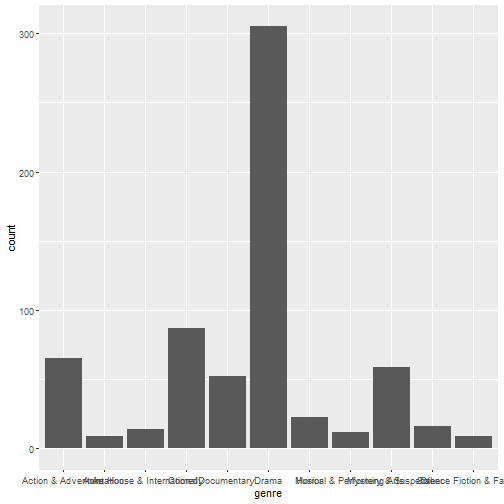

## Setup

### Load packages


```r
library(ggplot2)
library(dplyr)
library(statsr)
library(GGally)
library(vcd)
```

### Load data

Make sure your data and R Markdown files are in the same directory. When loaded
your data file will be called `movies`. Delete this note when before you submit 
your work. 


```r
#load("movies.Rdata")
```


* * *

## Part 1: Data

### Generalizability
"The data set is comprised of 651 randomly sampled movies produced and released before 2016." The statement is taken from the description page of the original data coming from. THe random sampled method is justified. 

### Causality 
There are 32 variables are listed in the data set, however not all of the variables can be used for statistical analysis or in building statistic models. One should be carefully in choosing the variables that might not be strongly dependent to each other to avoid generating unrelistic models or concluding inacurate analysis result. 

There are more than one set of variables are interested to be sought for association. 


* * *

## Part 2: Research question
Is there an association between the releasing date and the number of vots on IMDB or on critics score rotten tomatoes?

* * *

## Part 3: Exploratory data analysis
Let's first to parse the data, see what data types we have and each contains how many variables.


```r
#using table(sapply()) to parse the data to look for count of each data type
table(sapply(movies,class))
```

```
## 
## character    factor   integer   numeric 
##         9        12         1        10
```
It is clearly see we have four different types of data in our data set. Let us start digging into some non-numeric data analysis.

We can start to look at the genre of the data and plot the number of counts using a bar plot.

```r
ggplot(movies,aes(x = genre)) + geom_bar()
```



```r
summary(movies$genre)
```

```
##        Action & Adventure                 Animation Art House & International 
##                        65                         9                        14 
##                    Comedy               Documentary                     Drama 
##                        87                        52                       305 
##                    Horror Musical & Performing Arts        Mystery & Suspense 
##                        23                        12                        59 
##                     Other Science Fiction & Fantasy 
##                        16                         9
```

```r
sum(movies$genre)/sum(nrow(movies))
```

```
## Error in Summary.factor(structure(c(6L, 6L, 4L, 6L, 7L, 5L, 6L, 6L, 5L, : 'sum' not meaningful for factors
```
Interesting results, isn't it ? It seems like the movie genre is dominated by the Drama. Does that mean we are rejecting the random sampling as the observations said? Before we can be so assertive on that, let's mine more information out of the data.

## Testing the Generalizability
What else we can look at? Maybe we can look at the releasing year(both dvd and theater) and director who directed the movie. Why are we interested into those variables? The investigation in the year of releasing can help us to determine whether the movise are not random sampled up to date. And for analyzing the directors/actors to avoid that the data were sampled towards to a particular director or an actor.

### Releasing year investigation
Investigate how many movies were released each year up to date and find out if the most productive year of releasing the movies.

```r
#some analysis
table(movies$thtr_rel_year)
```

```
## 
## 1970 1972 1973 1974 1975 1976 1977 1978 1979 1980 1981 1982 1983 1984 1985 1986 1987 1988 1989 
##    1    3    4    8    5    4   12    7    7   12   11    6    7   10    6   10   14   13   14 
## 1990 1991 1992 1993 1994 1995 1996 1997 1998 1999 2000 2001 2002 2003 2004 2005 2006 2007 2008 
##   10   15   16   22    9   17   27   13   14   18   18   17   23   25   28   17   33   33   22 
## 2009 2010 2011 2012 2013 2014 
##   18   21   26   27   19    9
```

```r
max(table(movies$thtr_rel_year))
```

```
## [1] 33
```

```r
nrow(subset(movies, genre == "Drama" & thtr_rel_year == 2006))
```

```
## [1] 19
```

```r
nrow(subset(movies, genre == "Drama" & thtr_rel_year == 2007))
```

```
## [1] 16
```
From the summary above, there are 33 movies were released in two particular year 2006 and year 2007. And those released movies in those two years are Drama type only 16 and 17 respectively. Out of 651 sampled movies, that is less than 5%. In this case, we exclude the dependence between the releasing year and the random sampled method.

Similarly, we can proceed to seek for if the observations are based on a particular director or a particular actor.

```r
#The most number of the movies produced by certain director
max(table(movies$director))
```

```
## [1] 4
```

```r
#The most number of the movies have the same actor. 
max(table(movies$actor1))
```

```
## [1] 7
```

```r
max(table(movies$actor2))
```

```
## [1] 5
```

```r
max(table(movies$actor3))
```

```
## [1] 3
```

```r
max(table(movies$actor4))
```

```
## [1] 3
```

```r
max(table(movies$actor5))
```

```
## [1] 2
```
As we expected, the results of the movies with the most number of actor in and the most number of directors filmed all shows less than 5% of total sample population.

In this case, we can confirm that the movies were random sampled from the all movies from 1970 and up to date. There are more than 10% of the movies are "Drama" just by chance.


* * *

## Part 4: Modeling

NOTE: Insert code chunks as needed by clicking on the "Insert a new code chunk" 
button above. Make sure that your code is visible in the project you submit. 
Delete this note when before you submit your work.

* * *

## Part 5: Prediction

NOTE: Insert code chunks as needed by clicking on the "Insert a new code chunk" 
button above. Make sure that your code is visible in the project you submit. 
Delete this note when before you submit your work.

* * *

## Part 6: Conclusion

